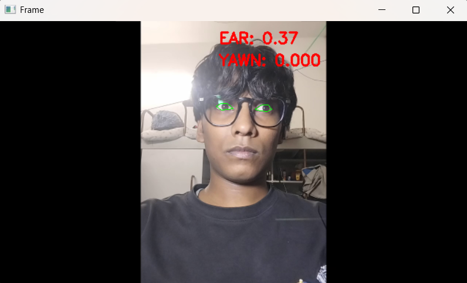
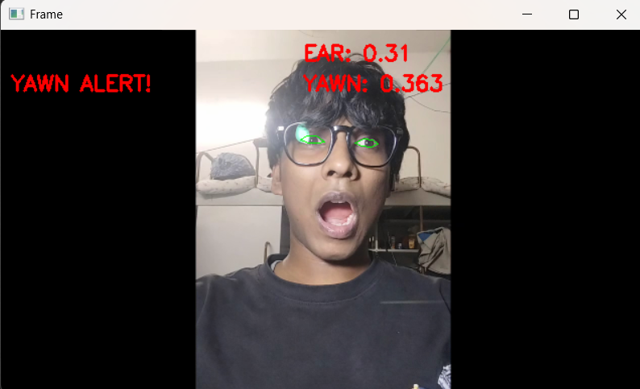
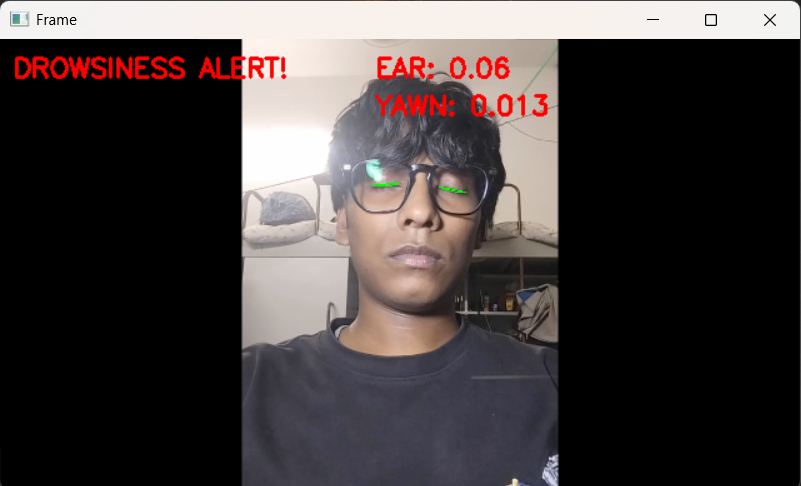

# Real-Time Drowsiness Detection System

This project detects drowsiness and yawning from a live camera feed and raises an audio alert when thresholds are crossed.

The current codebase is updated to run with **Python 3.12+**.

## Repository Structure

- `drowsiness_yawn.py`: main executable script
- `requirements.txt`: Python dependencies
- `Alert.wav`: alarm sound file used by the script
- `Images/`: **execution output snapshots captured while the project is running**

## Prerequisites

1. Python `3.12.x` installed and available in PATH
2. A camera source:
   - laptop webcam, or
   - phone virtual camera (for example Phone Link / DroidCam / Iriun)
3. Internet connection for first run (to auto-download MediaPipe model)

## Setup and Run (Step by Step)

### 1) Open terminal in project root

Windows CMD:

```cmd
cd /d "C:\Users\prakh\Desktop\Real-Time-Drowsiness-Detection-System-main"
```

PowerShell:

```powershell
cd "C:\Users\prakh\Desktop\Real-Time-Drowsiness-Detection-System-main"
```

### 2) (Optional but recommended) Create virtual environment

CMD:

```cmd
python -m venv venv
venv\Scripts\activate.bat
```

PowerShell:

```powershell
python -m venv venv
.\venv\Scripts\Activate.ps1
```

If PowerShell blocks activation, use:

```powershell
powershell -ExecutionPolicy Bypass -File .\venv\Scripts\Activate.ps1
```

### 3) Install dependencies

```bash
python -m pip install --upgrade pip setuptools wheel
pip install -r requirements.txt
```

### 4) Discover camera index

```bash
python drowsiness_yawn.py --list-cams
```

The script prints available camera indices (example: `[1, 2]`).

### 5) Run the application

Use one of the listed camera indices:

```bash
python drowsiness_yawn.py -w 1 -a .\Alert.wav
```

If index `1` does not show the correct feed, try `2` (or another listed index).

### 6) Stop the application

Press `q` while the video window is focused.

## Algorithm

1. Capture the image of the driver from the camera.
2. Send the captured image to haarcascade file for face detection.
3. If the face is detected then crop the image consisting of the face only. If the driver is distracted then a face might not be detected, so play the buzzer.
4. Send the face image to haarcascade file for eye detection.
5. If the eyes are detected then crop only the eyes and extract the left and right eye from that image. If both eyes are not found, then the driver is looking sideways, so sound the buzzer.
6. The cropped eye images are sent to the hough transformations for detecting pupils, which will determine whether they are open or closed.
7. If they are found to be closed for five continuous frames, then the driver should be alerted by playing the buzzer.

## Configuration

You can tune sensitivity with optional flags:

```bash
python drowsiness_yawn.py -w 1 -a .\Alert.wav --ear-thresh 0.25 --ear-frames 30 --yawn-thresh 0.045
```

- `--ear-thresh`: lower value = stricter eye-closure detection
- `--ear-frames`: number of consecutive low-EAR frames before drowsiness alert
- `--yawn-thresh`: normalized mouth-opening threshold for yawn alert

## Notes

- On first run, the script downloads a MediaPipe model to `models/face_landmarker.task`.
- The `shape_predictor_68_face_landmarks.dat` file is from the original dlib version and is not required by the Python 3.12 implementation.

## Troubleshooting

### Camera does not open

1. Run:

```bash
python drowsiness_yawn.py --list-cams
```

2. Use one of the printed indices with `-w`.
3. If no indices appear, verify your webcam/virtual camera is enabled in Windows.

### Dependency install fails

Make sure you are using Python 3.12 and run:

```bash
python -m pip install --upgrade pip setuptools wheel
pip install -r requirements.txt
```
## Testing and Results in Real-World Scenario.

The tests were conducted in various conditions including:
* Different lighting conditions.
* Driver's posture and position of the automobile driver's face.
* Drivers with spectacles.

### Results:

**1. Normal Condition (Eyes Open)**


**2. Drowsiness Detected (Eyes Closed)**


**3. Yawning Detected**


**4. Different Lighting Conditions**
 
## Future Scope

**Smart phone application:** It can be implemented as a smart phone application, which can be installed on smart phones. The automobile driver can start the application after placing it at a position where the camera is focused on the driver.
